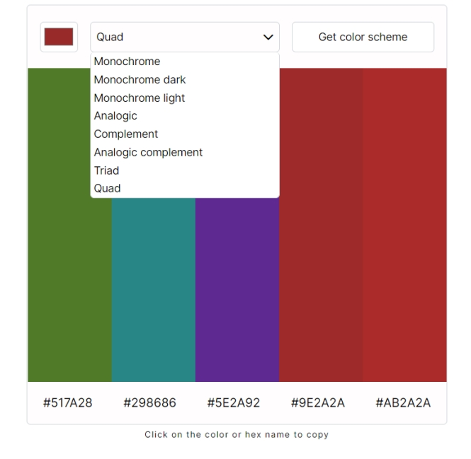

## Color Scheme Generator

### Scrimba solo project - Working with APIs
Project screen:

**Project page**:

[Color scheme generator]()

#### Project description:
Work with [The Color API](https://www.thecolorapi.com/)

Basic goals:
- choose "seed" color
- choose "scheme mode"
- make request to The Color API to get a color scheme
- display the scheme colors and hex values on the page

Stretch goals:
- click color divs or hex values to copy to clipboard

My additional goals:
- RWD
- build a dropdown menu instead of select